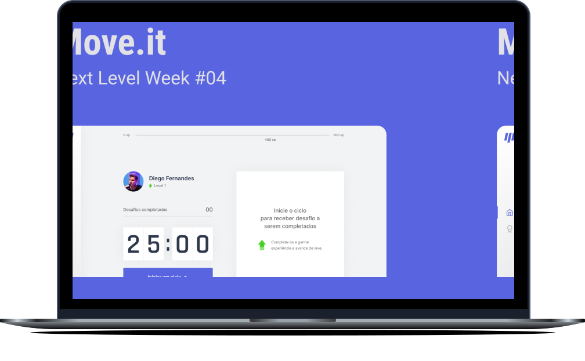

<h1 align="center">
    
</h1>

<p align="center">
  <a href="#technologies">Technologies</a>&nbsp;&nbsp;&nbsp;|&nbsp;&nbsp;&nbsp;
  <a href="#-preview">Preview</a>&nbsp;&nbsp;&nbsp;|&nbsp;&nbsp;&nbsp;
  <a href="#-layout">Getting started</a>&nbsp;&nbsp;&nbsp;|&nbsp;&nbsp;&nbsp;
  <a href="#-project">Project</a>&nbsp;&nbsp;&nbsp;|&nbsp;&nbsp;&nbsp;
  <a href="#-layout">Layout</a>&nbsp;&nbsp;&nbsp;|&nbsp;&nbsp;&nbsp;
  <a href="#-license">License</a>
</p>

<br>

<p align="center">
  
</p>

## 🧪 Technologies

This project was developed using the following technologies:

- [Next.js](https://nextjs.org/)
- [React](https://reactjs.org)
- [TypeScript](https://www.typescriptlang.org/)

## 🔥 Preview

[](https://nlw4-moveit-ten.vercel.app/)

## 🚀 Getting started

Clone the project and access the folder

```zsh
$ git clone https://github.com/abraaodev/nl4-moveit && cd nlw04-moveit
```

Follow the steps below

```zsh
# Install the dependencies
$ yarn

# Start the project
$ yarn dev
```

## 💻 Project

[Move.it] came to remind you to exercise always! 💜

## 🔖 Layout

You can view the project layout through the links below:

- [Layout Web](https://www.figma.com/file/ge20pu3ofMOKoliUyKx1Nl/Move.it-1.0)

Remembering that you need to have a [Figma](http://figma.com/) account to access it.

## 📝 License

This project is licensed under the MIT License. See the [LICENSE](LICENSE.md) file for details.

---

<p align="center">Made with 💜 by Abraão DEV</p>
